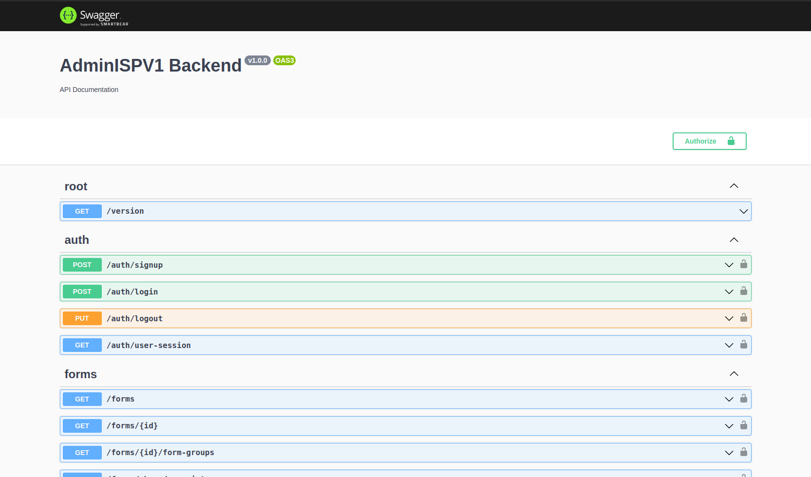
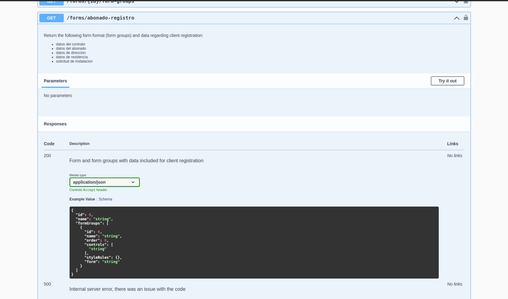

# AdminISPV1 Backend

This a backend for the AdminISPV1 platform, built with NestJS (boostrapped using Fastify).

## Installation

This project was built with `Node v16.18.0 LTS`, so keep that in mind as you host this backend on a server. The following are steps to take in order to have a functioning application.

1. Run `npm install` to install all dependencies.
2. Remove the `.example` suffix from the `.env` files and add the proper values to each variable.
    > If you don't want to delete `.env.development.example`, `.env.production.example` files and alter git's history, copy them and rename the copies without the `.example` suffix.
3. Run `npm run start` and you should have your service up and running, in order to serve your SPA make sure to place it inside the `public/` folder.
    > Your frontend should be responsible for building and placing the contents of your SPA inside the `public/` folder, in the case of a frontend using the angular cli, we can do this by changing the value defined in the `"outputPath"` option inside the `angular.json` file.

## Security

This backend posses all sort of security measures against dangers such as DoS (Denial of Service), DDoS (Distributed Denial of Service), XSS (Cross Site Scripting), open endpoints, lack of authentication, and other such cases. The following is a list of enabled tools (libraries and security aspects):

* helmet ✅
* CORS ✅
* Signed cookies ✅
* Throttler ✅
* Passport ✅
  * API Key Authorization Strategy ✅
  * Local Authorization Strategy ✅
* Request Body Validation ✅
  * Automatic pipe validation ✅
  * class-validator ✅
  * PickType(), OmitType() ✅
  * Safe query based resource lookup: ✅
    * This is OK: `/forms?name=my%20form` ✔️
    * This is not OK: `/forms?createdAt=2015-03-23-09.41.24.684842` ❌

> **IMPORTANT**: To establish a communication with some enpoints, the client MUST add to his HTTP request headers the header `X-API-Key`, the value should also be the same as the one defined in the `.env` files, otherwise your request WILL be rejected with a 401 status code.

### Things to note

* Signed cookies:
  * `fastify-cookie` is used for parsing cookies.
  * Security is set on our `main.ts` file.
  * Cookies are signed by default.
  * The custom `@Cookies` decorator under the `src/decorators` folder is in charge of unsigning the cookies, so you don't have to do it inside your controller.
* Local Authorization Strategy:
  * Refers to a Guard that handles user login attempts (checks if username and password match, that sort of thing).

## Configuration

Details about how this backend is configured such as global validation pipes, swagger setup, hot module reloading, configuration module/service, rate limiting, database connection, etc, should be found in `main.ts` and `app.module.ts`.

## NPM Scripts

### Running the app

```bash
# development
$ npm run start

# watch mode (development)
$ npm run start:dev

# production mode
$ npm run start:prod
```

### Test

```bash
# unit tests
$ npm run test

# e2e tests
$ npm run test:e2e

# test coverage
$ npm run test:cov
```

## Development policies

If you'd like to collaborate on this project, there are some **policies** that I would **appreciate** if you follow through.

1. **Naming convention for code**: camelCase.
2. **Documentation**: Currently the way this project maintains its documentation is through the use of [swagger](https://docs.nestjs.com/openapi/introduction) in NestJS. You can find documentation regarding API calls and their responses at the `/docs` route. If you're working on a new controller or expanding on an existing one, **please** follow the guide regarding [swagger](https://docs.nestjs.com/openapi/introduction) in order to mantain a **healthy codebase** and **collaborative environment**.

    At the moment `/docs` is only created when `process.env.NODE_ENV !== 'production'`, so basically it only exists for developers that work on this API, it's not meant to be public.

    This is how the documented API and request would look like:

    
    

    > Requests that require an API key are protected, you can authorize all requests when clicking the lock on the top right corner of `/docs` and then entering your key value.

    Lastly, remember that whatever type you pass to the `@ApiResponse` decorator should always be reflected by what your route handler returns, like so:

    ```typescript
    @Get('check-phrase/:message')
    @ApiOkResponse({ type: CheckPhraseResponse })
    checkPhrase(@Param('message') message: string): CheckPhraseResponse {
      // ...
      return { is_black_listed: msgIsProfane }
    }
    ```

3. **Folder structure**: Here is a breakdown of each subdirectory and what they should store.
    * **config**: [Custom configuration files](https://docs.nestjs.com/techniques/configuration#custom-configuration-files) used to define .env variables behaviour and way of access.
    * **dto**: Classes that are used in request body validations, as NestJS [suggests](https://docs.nestjs.com/techniques/validation#mapped-types).
    * **responses (NestJS non-standard)**: Classes that are used for [documenting](https://docs.nestjs.com/openapi/operations#responses) and defining the type of response a route should return. In order for swagger to detect these files that possess a suffix of `.response.ts` a new value was added to `"dtoFileNameSuffix"` inside the `nest-cli.json` file.

    > **IMPORTANT**: As a personal rule, considering this backend connects to a PostgreSQL database that uses a lot of tables and relationships, I've settled on creating [resources](https://docs.nestjs.com/recipes/crud-generator#generating-a-new-resource) that emulate the schemas in the database. For example if I have a schema called `auth`, an `auth/` folder would be made under `src/` for operations regarding this schema, it would have a controller, service(s), entities, interfaces, dtos, etc...

    Overall NestJS follows the same structure as an Angular project, so any good habits from there can be transferred over here.

4. **Routing**: [This](https://restfulapi.net/resource-naming/) resource explains it best, Nevertheless I shall point out a the cases I find that are most likely to implemented poorly.

    * **Use hyphens (-) to improve the readability of URIs**: As the title says, a good route should use hyphens to separate words, no underscores, no uppercase letters. Here's a simple example:

      ```bash
      auth/modules/:id/contentBlocks ✅
      auth/modules/:id/content-blocks ❌
      ```

    * **Singleton and Collection Resources**: put in a way that the previous resource already explained, basically if you have an entity `module`, we would create a route with the name of the entity in plural `modules` for operations that have something to do with it, this way we can write easy to read routes that can handle different cases without confusing anybody (as well as establish a clear hierarchy when dealing with relationships). I'll present an example of the wrong and right way of doing this:

      ```bash
      auth/getModule/:id ❌                 auth/modules/:id ✅
      auth/getAllModules ❌                 auth/modules ✅
      auth/getModule/:id/contentBlocks ❌   auth/modules/:id/content-blocks ✅
      ```

    * **Use query component to filter URI collection**: the resource already makes a good point about it so I will only provide with a practical example of this if the need ever arises:

      ```typescript
      // form-query.dto.ts
      import { PartialType, OmitType } from "@nestjs/swagger";
      import { Form } from "../entities/form.entity";

      /**
      * Class used for validation in lookups, for example:
      * /forms?id=1&name=registro%20abonados -> HTTP 200
      * /forms?name=consulta -> HTTP 200
      * /forms?formGroups=2 -> HTTP 404
      */
      export class FormQueryDto extends PartialType(OmitType(Form, ['formGroups'] as const)) {}


      // dynamic-content.service.ts
      public async findForm(fields: FormQueryDto): Promise<Form | null> {
        // for more details: https://orkhan.gitbook.io/typeorm/docs/repository-api
        return this.formsRepository.findOne({ where: fields });
      }
      ```
      In this example we simply use a Class `FormQueryDto` that basically describes the `Form` entity and does not include the `formGroups` property, in other words we pass an object to findForm with optional keys that match the columns of this `Form` entity/table and use them to generate a where clause.
      > **IMPORTANT**: Implementation may vary depending on whether ORM is being used or just plain SQL queries.

7. **Testing**: If you're working on a new module or adding some new functionality to the project, creating test files is by no means obligatory, **however**, if you're working on existing code which already has a test file with tests that are defined, it is your **responsibility** to mantain those tests if the objective of your work is to update or change the logic of what is being tested.

## Aditional notes

* When sending HTTP errors to the client, for a standard response among all routes please use NestJS built-in [exceptions](https://docs.nestjs.com/exception-filters#built-in-http-exceptions). For example:
  ```typescript
  // server side
  throw new BadRequestException('Bad request error', { cause: new Error(), description: 'Some error description' })

  // what the client receives
  {
    "message": "Bad request error",
    "error": "Some error description",
    "statusCode": 400,
  }
  ```

* Regarding the `cause` option property and the `Error` object, an error generated by the system should be of type `Error`, so the following should be acceptable:

  ```typescript
  // DatabaseService.service.ts
  async function find(id: number): Promise<Item> {
    let item = await this.db.execute('...', [id])
    return item
  }

  // item.controller.ts
  @Get(':id')
  example(@Param('id', ParseIntPipe) id: number) {
    try {
      let item = await this.databaseService.find(id)
      return item
    } catch (error) { // error should be of type Error
      throw new InternalServerErrorException('Internal server error', { cause: error, description: 'There was a problem finding an item with id=' + id })
    }
  }
  ```

  > Do take into account that NestJS already handles **internal server errors** when they occur due to a failed promise or bad code, therefore unless you want to be more explicit with your error message, there is no need to wrap your code inside a `try catch` in order to specify that an internal server occurred like the one in the example above.